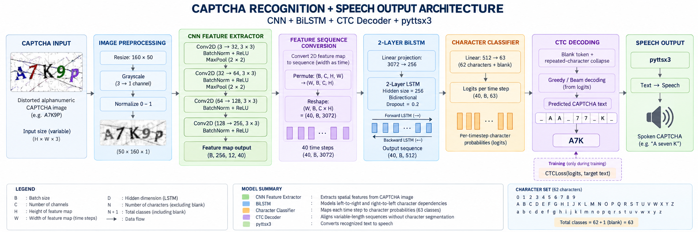
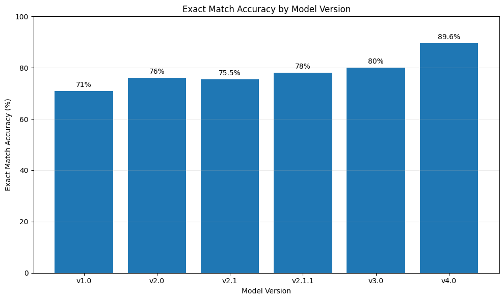

# CAPTCHA Detector for Accessibility

A lightweight deep learning-based CAPTCHA recognition system that recognizes distorted text-based CAPTCHAs using a CNN + BiLSTM + CTC architecture and converts the recognized CAPTCHA text into speech using `pyttsx3`.

The system performs end-to-end CAPTCHA recognition without requiring explicit character segmentation, making it suitable for accessibility-focused applications.

## 📌 Features

- CAPTCHA Image → Recognized Text
- CNN-based visual feature extraction
- Bidirectional LSTM for sequence modeling
- Connectionist Temporal Classification (CTC) for sequence recognition
- Recognition without explicit character segmentation
- 62-character vocabulary + CTC blank token
- Variable-width sequence prediction
- Text-to-Speech using `pyttsx3`
- Lightweight architecture for practical inference

## 🏗️ Model Architecture

<p align="center">

</p>

The model consists of three major components:

### CNN Encoder

The CNN extracts visual features from the CAPTCHA image.

The convolutional layers progressively increase the number of feature channels:

```text
3 → 32 → 64 → 128 → 256
```

Two max-pooling layers reduce the spatial dimensions while preserving sufficient width for sequence prediction.

For the tested input configuration, the CNN produces a feature map of the form:

```text
[B, 256, 12, W/4]
```

The width dimension is treated as the sequence dimension.

### BiLSTM

The CNN feature map is rearranged into a sequence so that each position along the image width represents a timestep.

The feature dimensions are:

```text
256 × 12 = 3072
```

A linear projection reduces the feature size before passing the sequence through a 2-layer Bidirectional LSTM.

```text
3072 → 256 → BiLSTM → 512
```

The BiLSTM produces 512 features per timestep because it contains 256 hidden units in each direction.

This allows the model to use both left-to-right and right-to-left contextual information when recognizing CAPTCHA characters.

### Character Classifier

A linear classifier maps the BiLSTM output to:

```text
63 classes
```

representing:

```text
62 characters + 1 CTC blank
```

The 62-character vocabulary consists of:

```text
0123456789
ABCDEFGHIJKLMNOPQRSTUVWXYZ
abcdefghijklmnopqrstuvwxyz
```

The model therefore produces a sequence of character logits rather than directly predicting one character for every CAPTCHA character.

### CTC

Connectionist Temporal Classification (CTC) is used to train and decode the character sequence without requiring explicit character-level segmentation.

CTC handles:

- Variable-length CAPTCHA strings
- Variable-length prediction sequences
- Blank tokens
- Repeated character predictions
- Alignment between image features and target text

During decoding, blank tokens are removed and consecutive repeated predictions are collapsed to obtain the final CAPTCHA text.

## 🔊 Text-to-Speech

After the CAPTCHA text is recognized, the predicted string is passed to `pyttsx3`.

```text
CAPTCHA Image
      ↓
CNN Encoder
      ↓
BiLSTM
      ↓
Character Classifier
      ↓
CTC Decoding
      ↓
Recognized Text
      ↓
pyttsx3
      ↓
Speech Output
```

This provides an audio representation of the recognized CAPTCHA text for users who may have difficulty reading visual CAPTCHAs.

## 🧪 Experiments

Multiple model versions were developed and evaluated incrementally to study the effect of architectural changes, training strategies, and dataset improvements on CAPTCHA recognition performance.

| Version | Major Changes | Observation | 
|---|---|---|
| **v1.0** | Baseline CNN + 1-layer BiLSTM | Baseline performance 
| **v2.0** | Added character-level accuracy metric + 2-layer BiLSTM with hidden size 128 | Improved performance 
| **v2.1** | Increased BiLSTM hidden size from 128 to 256 | No significant improvement and accuracy was highly unstable after few epochs 
| **v2.1.1** | Added learning-rate scheduler with plateau-based LR reduction | Improved training stability and performance 
| **v3.0** | 4 CNN blocks without max-pooling to preserve character localization | Significant improvement 
| **v4.0** | Trained on a larger unified dataset while preserving the previous versions' weights | Best-performing version 

Overall accuracy for each version:

<p align="center">

</p>

#### 🏆 Best Model — v4.0

The v4.0 model achieved the best performance among the tested configurations, reaching:

- **Character Accuracy:** 97.10%
- **Exact Match Accuracy:** 89.63%

The improvement was achieved by training on the larger unified CAPTCHA dataset.

## 📊 Dataset

The model is trained on a unified CAPTCHA dataset created by combining multiple publicly available CAPTCHA datasets from Kaggle.

The combined dataset contains CAPTCHA images with variations in:

- Character combinations
- CAPTCHA lengths
- Fonts
- Backgrounds
- Noise
- Distortion
- Character placement
- Image styles

### Unified CAPTCHA Dataset

The final dataset used for training is available on Kaggle:

**[Unified CAPTCHA Dataset – Kaggle](https://www.kaggle.com/datasets/rvshekar/ver2-unified-captcha-dataset)**

The dataset was created by merging and standardizing multiple publicly available CAPTCHA datasets into a common format.


## 🌐 Streamlit Deployment

The project includes a Streamlit web application for interactive CAPTCHA recognition.

To run the application locally:

```bash
streamlit run app.py
```
or
```bash
python -m streamlit run app.py
```

## ⚙️ Installation

Clone the repository:

```bash
git clone https://github.com/RVScoder/CAPTCHA-detector.git
```

Install the required dependencies:

```bash
pip install -r requirements.txt
```

## 🔮 Prediction

Run prediction using:

```bash
python inference.py
```

Example:

```text
Enter CAPTCHA Image Path:
> captcha.png

Predicted CAPTCHA:
> A7kP29
```

The recognized CAPTCHA text is converted into speech using `pyttsx3`.


## 🚀 Training

The Kaggle dataset is required for training the model.

Download the [Unified CAPTCHA Dataset](https://www.kaggle.com/datasets/rvshekar/ver2-unified-captcha-dataset) from Kaggle and place it in the location specified in `config.py`.

The dataset can be used with either:

- The training notebook in `notebooks/`
- The training script `train.py`

The training pipeline performs:

1. CAPTCHA image loading
2. Image preprocessing
3. CNN feature extraction
4. BiLSTM sequence modeling
5. Character classification
6. CTC loss computation
7. Backpropagation and optimization
8. CTC decoding for evaluation

The model is trained using CTC loss, which removes the need for explicit character segmentation.

## 📂 Project Structure

```text
CAPTCHA-detector/
│
├── assets/
│   └── captcha_architecture.png
│
├── dataset/
│   ├── captcha_dataset.py
│   ├── collate_fn.py
│   ├── dataloader.py
│   └── vocab.py
│
├── models/
│   ├── bilstm.py
│   ├── captcha_model.py
│   ├── classifier.py
│   └── cnn.py
│
├── notebooks/
│   ├── captcha-training_ver1.0.ipynb
│   └── captcha-training_ver4.0.ipynb
│
├── output/
│   ├── best_captcha_model.pth
│   └── ckpt_captcha_model.pth
│
├── app.py
├── config.py
├── inference.py
├── predict.py
├── train.py
├── tts.py
├── requirements.txt
├── README.md
├── .gitignore
│
├── captcha-dataset.zip
└── captcha-dataset-2.zip
```

## 🛠️ Technologies Used

- Python
- PyTorch
- TorchVision
- CNN
- BiLSTM
- Connectionist Temporal Classification (CTC)
- pyttsx3
- NumPy
- Pillow

## 🚀 Future Improvements

- Improve recognition accuracy on highly distorted CAPTCHAs.
- Train on a larger and more diverse CAPTCHA dataset.
- Experiment with pretrained CNN backbones such as MobileNetV2.
- Improve image preprocessing and augmentation.
- Experiment with attention-based sequence models.

## 📚 References

### PyTorch

https://pytorch.org/

### Connectionist Temporal Classification

https://distill.pub/2017/ctc/

### TorchVision

https://pytorch.org/vision/

### pyttsx3

https://pyttsx3.readthedocs.io/